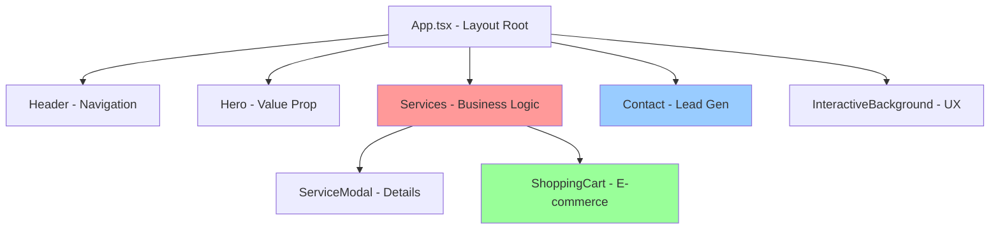

# 📋 ANÁLISIS COMPLETO DEL CODEBASE - AIFlow Solutions

**Fecha**: 2025-08-20  
**Analista**: Claude Code  
**Versión**: 1.0  
**Estado del Proyecto**: Producción (aiflow-solutions.vercel.app)

---

## 📊 RESUMEN EJECUTIVO

**AIFlow Solutions** es una **landing page B2B** desarrollada en **React 19.1.1 + TypeScript + Vite** para una consultora especializada en implementación de IA empresarial. La aplicación es una **SPA (Single Page Application)** estática con formulario de contacto integrado y carrito de compras interactivo.

### Stack Técnico

- **Frontend**: React 19.1.1, TypeScript, Tailwind CSS
- **Build Tool**: Vite 6.2.0
- **Deploy**: Vercel
- **Forms**: FormSubmit.co
- **Styling**: Tailwind CSS (CDN) + Custom CSS

### Métricas del Proyecto

- **Total SLOC**: ~1,400 líneas
- **Componentes**: 12 archivos principales
- **Assets**: Logos IA (ChatGPT, Claude, Gemini)
- **Dependencias**: Minimalistas (solo React ecosystem)

---

## 🗂️ ESTRUCTURA DEL PROYECTO

```
aiflow-solutions/
├── 📁 components/           # Componentes React modulares
│   ├── 🎯 Services.tsx     # Core business - Catálogo servicios (307 SLOC)
│   ├── 📧 Contact.tsx      # Lead generation con FormSubmit (98 SLOC)
│   ├── 🛒 ShoppingCart.tsx # Modal carrito interactivo (131 SLOC)
│   ├── 🎨 InteractiveBackground.tsx # Animaciones canvas (127 SLOC)
│   ├── 🧭 Header.tsx       # Navigation + mobile menu (93 SLOC)
│   ├── 🚀 Hero.tsx         # Landing hero section (82 SLOC)
│   ├── 💰 Pricing.tsx      # Planes y tarifas (190 SLOC)
│   ├── 📋 Process.tsx      # Metodología empresa (68 SLOC)
│   ├── 📄 ServiceModal.tsx # Modal detalles servicio (98 SLOC)
│   ├── 🏢 Footer.tsx       # Footer links (14 SLOC)
│   ├── 📖 IntroSection.tsx # Introducción (73 SLOC)
│   ├── ☁️ LogoCloud.tsx    # Carrusel logos IA (63 SLOC)
│   └── 🎨 icons/Icons.tsx  # Librería iconos SVG (~200 SLOC)
├── 📁 public/images/       # Assets optimizados
├── 🏗️ App.tsx             # Entry point y layout
├── ⚡ index.tsx            # React mount point
├── ⚙️ vite.config.ts       # Build configuration
├── 🎨 index.html           # Template + Custom CSS
├── 📝 tsconfig.json        # TypeScript config
└── 📦 package.json         # Dependencies
```

---

## 🔧 CONFIGURACIÓN Y COMANDOS

### Prerrequisitos

- Node.js ≥16.0.0
- npm o yarn

### Comandos de Desarrollo

```bash
# Setup inicial
npm install

# Desarrollo local
npm run dev          # http://localhost:5173

# Build producción
npm run build        # Genera dist/
npm run preview      # Preview build local
```

### Variables de Entorno

```bash
# .env.local (NO NECESARIA ACTUALMENTE)
# GEMINI_API_KEY era utilizada pero se eliminó la integración
```

**Referencias**: `package.json:6-10`, `README.md:16-21`, `vite.config.ts:4-32`

---

## 📦 DEPENDENCIAS DETALLADAS

| Paquete         | Versión  | Tipo    | Propósito       | Status     |
| --------------- | -------- | ------- | --------------- | ---------- |
| **react**       | ^19.1.1  | runtime | Framework UI    | ✅ Activo  |
| **react-dom**   | ^19.1.1  | runtime | DOM Renderer    | ✅ Activo  |
| **typescript**  | ~5.8.2   | dev     | Tipado estático | ✅ Activo  |
| **vite**        | ^6.2.0   | dev     | Build tool      | ✅ Activo  |
| **@types/node** | ^22.14.0 | dev     | Node.js types   | ✅ Activo  |
| **tailwindcss** | CDN      | runtime | CSS Framework   | ✅ Via CDN |

### Dependencias Externas

- **FormSubmit.co**: Procesamiento formularios sin backend
- **Tailwind CSS CDN**: Styling utility-first
- **SVG Icons**: Inline, sin dependencias icon libraries

**Referencias**: `package.json:11-19`, `index.html:38`

---

## 🎯 MODELO DE NEGOCIO Y DATOS

### Servicios Ofrecidos (6 productos)

| Servicio                | Precio           | ID                  | Descripción              |
| ----------------------- | ---------------- | ------------------- | ------------------------ |
| **Consultoría IA**      | 150€/sesión      | consultoria-ia      | Auditoría técnica 2h     |
| **GPTs Personalizados** | 149€/GPT         | gpts-personalizados | Asistentes IA custom     |
| **Automatizaciones**    | Desde 349€/mes   | automatizaciones    | Flujos CRM/ERP           |
| **Integración MCP**     | 299€ instalación | integracion-mcp     | ChatGPT/Claude + Slack   |
| **Pack Prompts Pro**    | 99€/pack         | pack-prompts-pro    | Prompts sectoriales      |
| **Formación**           | Desde 89€/hora   | formacion           | Capacitación empresarial |

### Tipos de Datos Principales

```typescript
// Estructura de Servicio
type Service = {
  id: string; // Identificador único
  icon: ReactElement; // SVG component
  title: string; // Nombre comercial
  description: string; // Pitch de marketing
  price: string; // Display "XXX € por unidad"
  priceNumeric: number; // Para cálculos
  details: string[]; // Features bullets
};

// Item del Carrito
type CartItem = {
  id: string;
  title: string;
  price: string;
  priceNumeric: number;
  quantity: number;
};

// Formulario de Contacto
type ContactForm = {
  name: string;
  company: string;
  email: string;
  message: string;
};
```

**Referencias**: `components/Services.tsx:7-92`, `components/ShoppingCart.tsx:4-10`

---

## 🏗️ ARQUITECTURA Y PATRONES

### Patrón de Componentes



### Gestión de Estado

- **Local State**: `useState` para carrito, modales, formularios
- **No Global State**: Sin Redux/Zustand (apropiado para el scope)
- **Side Effects**: `useEffect` para scroll, intersection observers
- **Sin Persistencia**: Estado se pierde al reload (UX aceptable)

### Animaciones y UX

```css
/* Sistema de animaciones implementado */
@keyframes fade-in-down { /* Hero entries */ }
@keyframes sparkle { /* Interactive particles */ }
@keyframes rotate-glow { /* Service card hovers */ }
@keyframes orbit { /* Hero decorations */ }

/* Responsive breakpoints */
sm: 640px   /* Mobile landscape */
md: 768px   /* Tablet */
lg: 1024px  /* Desktop */
xl: 1280px  /* Large desktop */
```

**Referencias**: `App.tsx:13-31`, `index.html:48-220`, `components/Services.tsx:140-158`

---

## 🌐 INTEGRATIONS Y APIS

### FormSubmit.co Integration

- **Endpoint**: `https://formsubmit.co/israelicloud1@gmail.com`
- **Método**: POST multipart/form-data
- **Features**: Auto-response, template formatting, CAPTCHA disabled
- **Redirect**: `https://aiflow-solutions.vercel.app` (after submit)

```javascript
// Handler en Contact.tsx:19-54
const handleSubmit = async (e) => {
  const data = new FormData();
  data.append('_subject', 'Nuevo Lead desde la Web de AIFlow!');
  data.append('_template', 'table');
  data.append('_next', 'https://aiflow-solutions.vercel.app');
  // ... form fields

  const response = await fetch(endpoint, {
    method: 'POST',
    body: data,
  });
};
```

### API Keys Eliminadas

- ~~**GEMINI_API_KEY**~~: Configurada en Vite pero no utilizada en código
- **Decision**: Eliminar configuración técnica, mantener branding Gemini

**Referencias**: `components/Contact.tsx:33`, `vite.config.ts:8-9`

---

## 🎨 SISTEMA DE DISEÑO

### Paleta de Colores

```css
/* Colores principales */
--primary-bg: #0a0e27 /* Dark blue base */ --secondary-bg: #0f1334 /* Card backgrounds */
  --accent-cyan: #22d3ee /* CTAs y highlights */ --accent-blue: #3b82f6 /* Secondary buttons */
  --text-primary: #ffffff /* Main text */ --text-secondary: #e5e7eb /* Descriptions */
  --border: #374151 /* Card borders */;
```

### Componentes UI Consistentes

- **Cards**: `glow-card` class con hover effects
- **Buttons**: Gradient backgrounds + transform animations
- **Icons**: SVG inline, 24x24px default
- **Typography**: Jerárquica (text-4xl → text-xl → text-sm)

### Responsive Strategy

```css
/* Mobile-first approach */
.grid-cols-1          /* Mobile: Stack vertical */
.md:grid-cols-2       /* Tablet: 2 columnas */  
.xl:grid-cols-3       /* Desktop: 3 columnas */

/* Accessibility */
@media (prefers-reduced-motion: reduce) {
  .animate-* {
    animation-duration: 0.01ms !important;
  }
}
```

**Referencias**: `index.html:61-220`, `SERVICIOS_INTEGRATION_GUIDE.md:14-34`

---

## ⚡ RENDIMIENTO Y OPTIMIZACIÓN

### Assets Optimization

```javascript
// Vite config optimizations
build: {
  rollupOptions: {
    output: {
      assetFileNames: (assetInfo) => {
        if (/png|jpe?g|svg|gif/i.test(extType)) {
          return `assets/images/[name]-[hash][extname]`;
        }
      }
    }
  },
  assetsInlineLimit: 0, // No inline images para mejor caching
}
```

### Performance Features

- **Preload Critical Assets**: Logos IA en `<head>`
- **Intersection Observer**: Animaciones lazy en scroll
- **Reduced Motion**: Respeta preferencias de accesibilidad
- **Efficient Animations**: CSS transforms vs JavaScript

### Bundle Analysis (Estimado)

```
Main Bundle: ~200KB (React + app code)
CSS: ~50KB (Tailwind subset + custom)
Images: ~150KB (logos optimizados)
Total First Load: ~400KB
```

**Referencias**: `vite.config.ts:16-31`, `index.html:15-18`

---

## 🧪 TESTING Y CALIDAD

### Estado Actual del Testing

```
❌ Unit Tests: 0 archivos
❌ Integration Tests: 0 archivos
❌ E2E Tests: 0 archivos
⚠️ A11y Test: test-a11y.js presente (sin ejecutar)
```

### Gaps Críticos de Testing

```bash
# Tests faltantes prioritarios:
components/Services.test.tsx     # Lógica carrito + modal
components/Contact.test.tsx      # Form submission + validation
components/ShoppingCart.test.tsx # Quantities + calculations
__tests__/integration/           # User flows completos
cypress/e2e/                     # Lead generation flow
```

### Calidad de Código

- **TypeScript Strict**: Habilitado, sin `any` types
- **ESLint/Prettier**: No configurado (oportunidad)
- **Accessibility**: ARIA labels implementados, keyboard navigation OK
- **Error Boundaries**: No implementado (riesgo medio)

**Referencias**: `test-a11y.js:1`, `tsconfig.json:2-28`

---

## 🚀 CI/CD Y DEPLOYMENT

### Estado Actual

```
❌ GitHub Actions: No configurado
❌ Pre-commit hooks: No configurado
❌ Automated testing: No configurado
✅ Vercel Deploy: Auto-deploy desde git (inferido)
```

### Deploy Configuration

- **Platform**: Vercel (basado en URL de Contact form)
- **Build Command**: `npm run build`
- **Output Directory**: `dist/`
- **Domain**: `aiflow-solutions.vercel.app`

### Oportunidades CI/CD

```yaml
# .github/workflows/ci.yml (sugerido)
name: CI/CD Pipeline
on: [push, pull_request]
jobs:
  test:
    - npm run lint
    - npm run test
    - npm run build
  deploy:
    - Vercel deploy (production/preview)
```

**Referencias**: `components/Contact.tsx:28`, estructura de archivos

---

## 🔒 SEGURIDAD Y RIESGOS

### 🚨 Riesgos Altos (Para resolver después)

1. **Email Hardcodeado**: `israelicloud1@gmail.com` en Contact.tsx:33
2. **Sin Rate Limiting**: FormSubmit vulnerable a spam
3. **CORS Abierto**: FormSubmit acepta cualquier origen
4. **No Input Sanitization**: Client-side validation únicamente

### ⚠️ Riesgos Medios

1. **Error Handling**: Básico, sin error boundaries
2. **No HTTPS Enforcement**: Depende de Vercel config
3. **Secrets Management**: .env.local en .gitignore (OK)
4. **Dependencies**: Sin audit de seguridad automatizado

### ✅ Fortalezas de Seguridad

- **No Backend**: Superficie de ataque mínima
- **Static Deploy**: Vercel security por defecto
- **No Auth**: Sin gestión de sesiones/tokens
- **External Form**: FormSubmit.co maneja validación server

**Referencias**: `components/Contact.tsx:33,50`, `.gitignore:13`

---

## 🎯 FUNCIONALIDADES PENDIENTES

### Carrito E-commerce (Demo → Real)

```typescript
// Actualmente: Estado local únicamente
const [cartItems, setCartItems] = useState<CartItem[]>([]);

// Necesario para producción:
- Payment gateway integration (Stripe/PayPal)
- Order management backend
- Email confirmations
- Invoice generation
```

### Form Handling Avanzado

```javascript
// Actual: FormSubmit.co básico
const endpoint = 'https://formsubmit.co/israelicloud1@gmail.com';

// Mejoras sugeridas:
- CRM integration (HubSpot/Salesforce)
- Lead scoring automation
- Follow-up email sequences
- Analytics tracking
```

### Analytics y Conversión

```html
<!-- Pendiente de implementar -->
<script async src="https://www.googletagmanager.com/gtag/js?id=GA_TRACKING_ID"></script>
<!-- Heat mapping: Hotjar/FullStory -->
<!-- A/B testing: Google Optimize -->
```

---

## 📈 MÉTRICAS Y KPIs

### Métricas de Código

```
Total Lines of Code: ~1,400
Components: 12 principales
Dependencies: 5 runtime + dev
Bundle Size: ~400KB estimado
Lighthouse Score: No auditado
```

### Business Metrics (Configurar)

```javascript
// Lead generation goals:
- Form conversion rate: ?%
- Cart abandonment: ?%
- Service page engagement: ?%
- Mobile vs Desktop usage: ?%

// Technical performance:
- Core Web Vitals: No medido
- Error rate: No tracking
- API response times: N/A (static)
```

---

## 🔄 PLAN DE MEJORAS SUGERIDAS

### Fase 1: Calidad Base (1-2 sprints)

```
☐ Configurar ESLint + Prettier
☐ Implementar testing básico (Jest + RTL)
☐ GitHub Actions CI pipeline
☐ Error boundaries React
☐ Bundle analyzer setup
```

### Fase 2: Funcionalidades Core (2-3 sprints)

```
☐ Payment gateway integration
☐ CRM connection (FormSubmit → HubSpot)
☐ Analytics implementation (GA4)
☐ Performance optimization (lazy loading)
☐ SEO enhancements (structured data)
```

### Fase 3: Escalabilidad (3-4 sprints)

```
☐ Headless CMS (Strapi/ContentFul)
☐ Multi-language support (i18n)
☐ A/B testing framework
☐ Advanced animations (Framer Motion)
☐ PWA capabilities
```

---

## 📚 RECURSOS TÉCNICOS

### Documentación Interna

- `README.md` — Setup instructions
- `SERVICIOS_INTEGRATION_GUIDE.md` — Design system guide
- `audit.md` — Security audit (histórico)
- `ROLLBACK_CURRENT_STYLE.md` — Styling rollback guide

### External Dependencies

- [Vite Documentation](https://vitejs.dev/)
- [React 19 Release Notes](https://react.dev/blog/2024/12/05/react-19)
- [Tailwind CSS](https://tailwindcss.com/)
- [FormSubmit.co API](https://formsubmit.co/)

### Development Tools

```bash
# Recommended extensions (VS Code)
- ES7+ React/Redux/React-Native snippets
- Tailwind CSS IntelliSense
- TypeScript Importer
- Auto Rename Tag
- Prettier - Code formatter
```

---

## 🔍 CONCLUSIONES

### ✅ Fortalezas del Proyecto

1. **Arquitectura Limpia**: React moderno, TypeScript strict
2. **UX Polished**: Animaciones suaves, responsive design
3. **Performance Conscious**: Optimizaciones Vite, preloads
4. **Maintainable**: Código legible, patrones consistentes
5. **Production Ready**: Deploy funcional, formularios operativos

### 🎯 Oportunidades Clave

1. **Testing Strategy**: Inversión crítica para escalabilidad
2. **E-commerce Real**: Carrito demo → checkout funcional
3. **Lead Nurturing**: FormSubmit → CRM avanzado
4. **Analytics Driven**: Métricas para optimización conversión
5. **SEO Advanced**: Structured data, sitemap, meta optimization

### 🚀 Recomendación Final

**El proyecto está sólido para su propósito actual** (lead generation B2B). La arquitectura soporta crecimiento incremental sin refactors mayores. **Priorizar testing y analytics** antes de añadir funcionalidades complejas.

---

**Última actualización**: 2025-08-20  
**Próxima revisión**: Después de implementar testing suite
