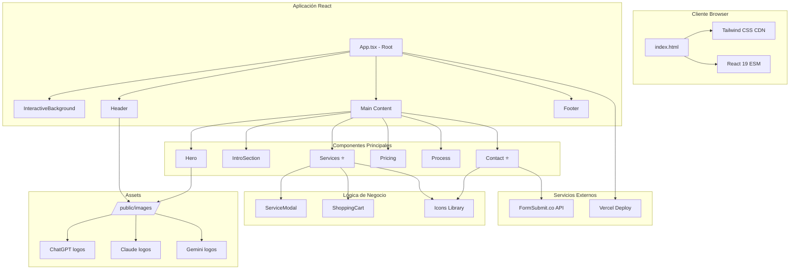
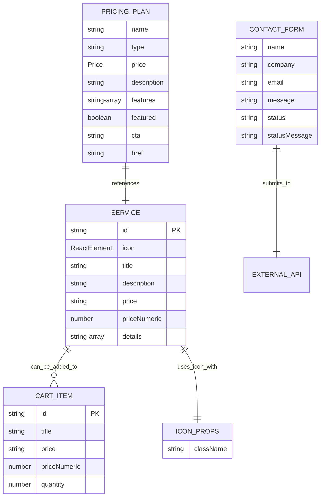
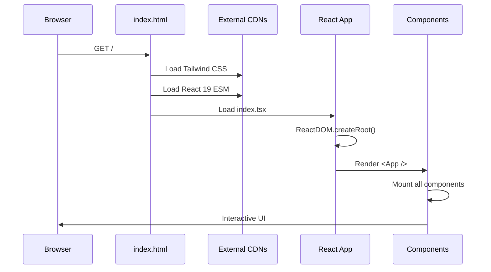
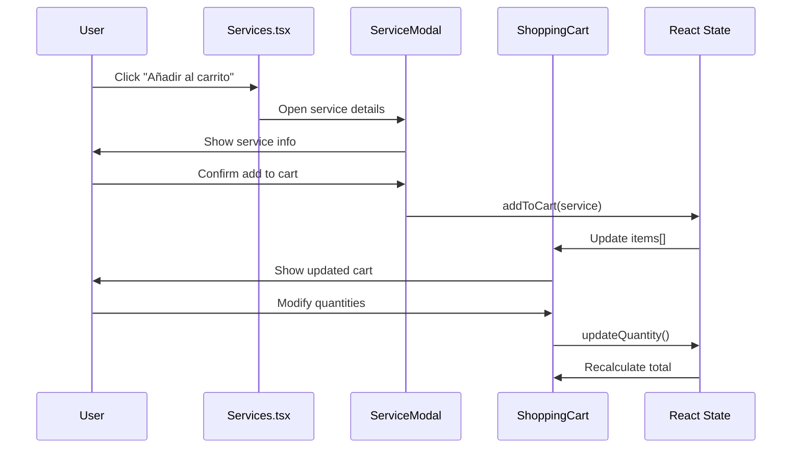
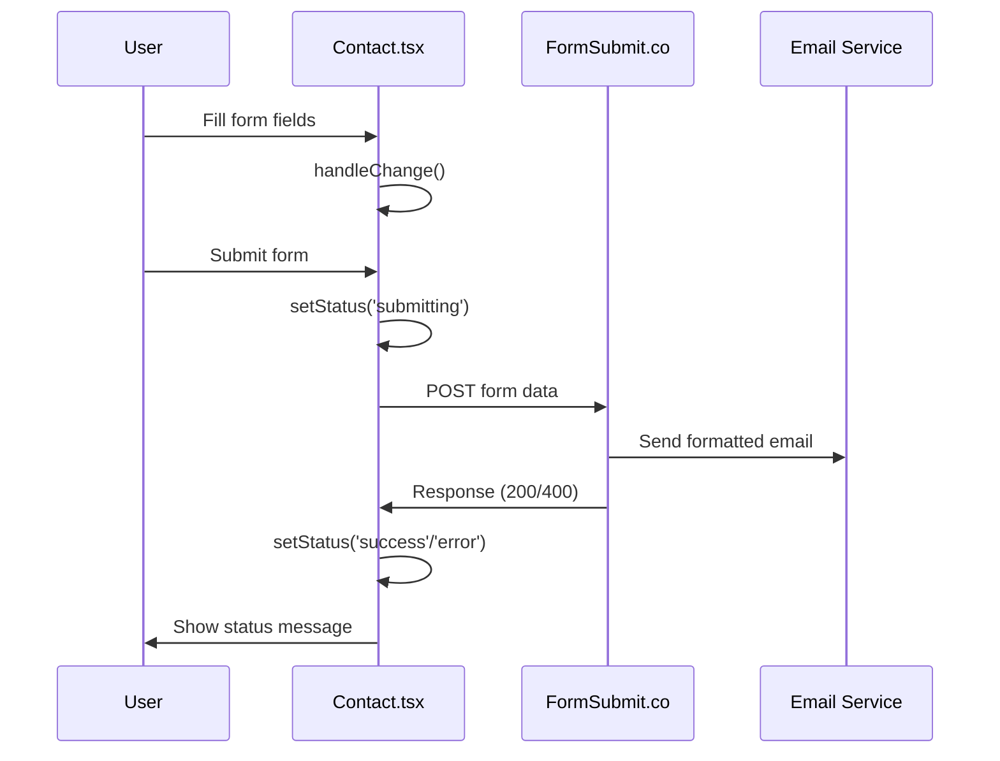
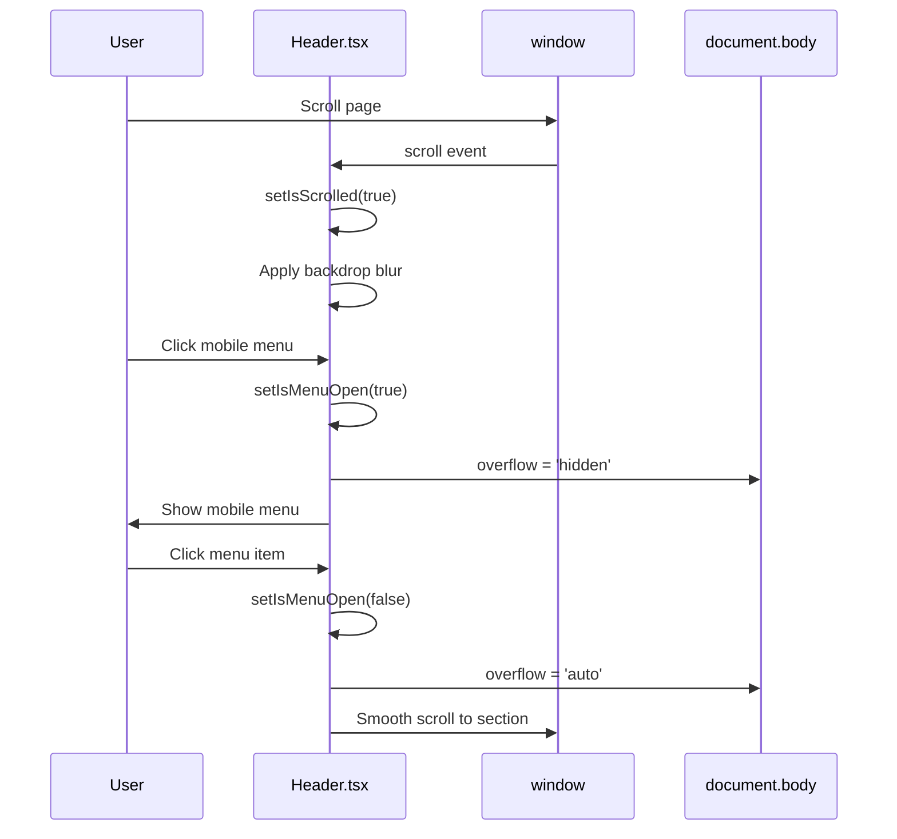
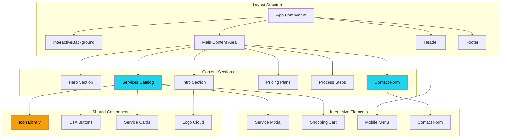
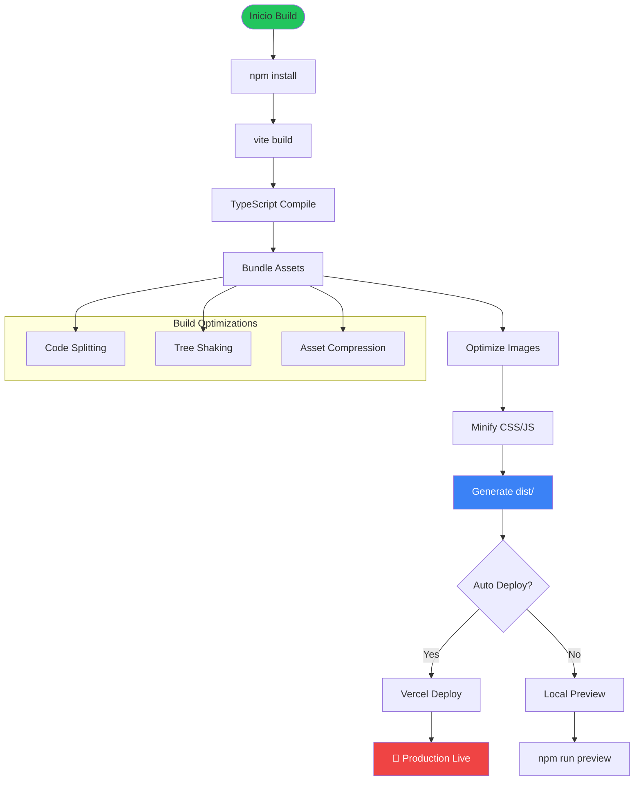

# Diagramas de Arquitectura - AIFlow Solutions

## 🏗️ Diagrama de Arquitectura General



## 📦 Grafo de Dependencias por Módulo

```mermaid
graph LR
    subgraph "Runtime Dependencies"
        R19[React 19.1.1]
        RD19[ReactDOM 19.1.1]
    end

    subgraph "Development Dependencies"
        TS[TypeScript 5.8.2]
        VITE[Vite 6.2.0]
        TYPES[@types/node 22.14.0]
    end

    subgraph "External CDN"
        TW[Tailwind CSS]
        REACT_ESM[React ESM Imports]
    end

    subgraph "Build Process"
        SRC[Source TS/TSX]
        DIST[dist/ Build Output]
        HTML_OUT[Static HTML + Assets]
    end

    R19 --> RD19
    TS --> SRC
    VITE --> SRC
    SRC --> DIST
    DIST --> HTML_OUT

    TW --> HTML_OUT
    REACT_ESM --> HTML_OUT

    style R19 fill:#61dafb
    style VITE fill:#646cff
    style TS fill:#3178c6
```

## 🗄️ Diagrama de Entidades (Modelo de Datos)



## 🔄 Call Graph - Flujos Principales

### 1. Flujo de Carga de Aplicación



### 2. Flujo de Carrito de Compras



### 3. Flujo de Formulario de Contacto



### 4. Flujo de Navegación Responsive



## 🎨 Diagrama de Componentes UI



## 📊 Diagrama de Flujo de Build



---

**Fuente de Datos**: Análisis de código fuente en C:\Users\Troll\Desktop\aiflow-solutions\  
**Herramientas**: Mermaid.js para visualización  
**Fecha**: 2025-08-20  
**Versión**: 1.0
